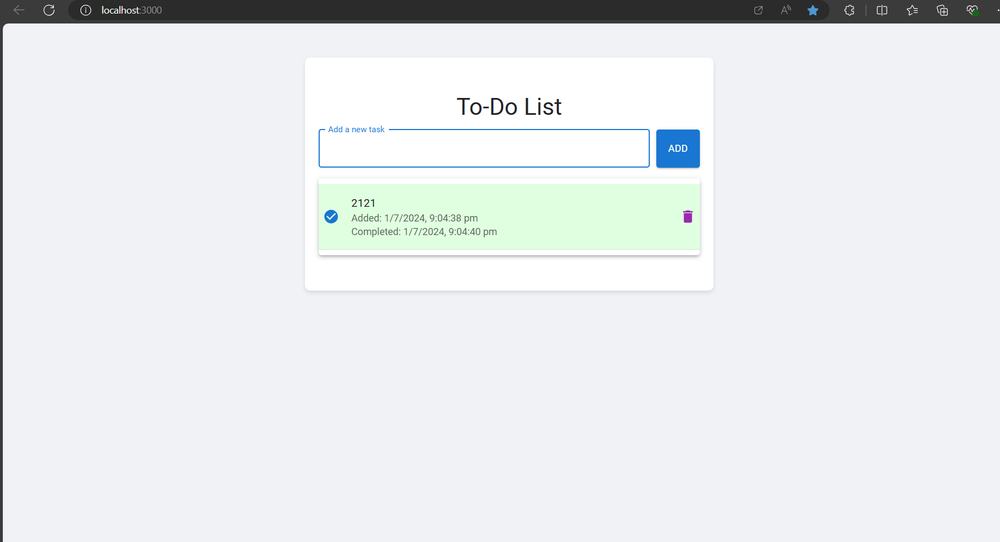

# To-Do List Application



A simple To-Do List application built with React and styled using Material-UI. Allows users to add tasks, mark them as complete, delete tasks, and view task details.

## Table of Contents

- [Overview](#overview)
- [Demo](#demo)
- [Features](#features)
- [Setup](#setup)
  - [Prerequisites](#prerequisites)
  - [Installation](#installation)
  - [Running the Application](#running-the-application)
- [Usage](#usage)
  - [Adding Tasks](#adding-tasks)
  - [Marking Tasks as Complete](#marking-tasks-as-complete)
  - [Deleting Tasks](#deleting-tasks)
  - [Viewing Task Details](#viewing-task-details)
- [Folder Structure](#folder-structure)
- [Technologies Used](#technologies-used)
- [Contributing](#contributing)
- [License](#license)

## Overview

This project is a To-Do List application built with React and styled using Material-UI. It provides basic task management functionalities where users can add, mark as complete, delete tasks, and view task details including timestamps for when tasks were added and completed.

## Demo

[Live Demo](https://your-todo-app-demo-url.com)


## Features

- Add tasks with timestamps.
- Mark tasks as complete/uncomplete.
- Delete tasks from the list.
- View task details including creation and completion timestamps.
- Responsive design using Material-UI components.

## Setup

### Prerequisites

Before running the application, make sure you have the following installed:

- Node.js
- npm or yarn (Node Package Managers)

### Installation

1. Clone the repository:

   ```bash
   git clone <repository-url>
   cd todo-app
Install dependencies:

bash
Copy code
npm install
# or
yarn install
Running the Application
Start the development server:

bash
Copy code
npm start
 or
yarn start

Open http://localhost:3000 in your browser to view the application.

Usage
**Adding Tasks**
To add a new task:

Enter the task description in the input field labeled "Add a new task".
Click the "Add" button to add the task to the list.

**Marking Tasks as Complete**
To mark a task as complete:

Click on the checkbox next to the task. Completed tasks will display a green check icon.
**Deleting Tasks**
To delete a task:

Click on the trash can icon next to the task. The task will be permanently removed from the list.
Viewing Task Details
Each task displays additional details:

Added: Shows the date and time when the task was added.
Completed: If the task has been marked as complete, it shows the date and time when it was completed.
Technologies Used
React
Material-UI
JavaScript (ES6+)
Contributing
Contributions are welcome! If you have suggestions for improvements or would like to add new features, please follow these steps:

Fork the repository.
Create a new branch (git checkout -b feature-name).
Make your changes.
Commit your changes (git commit -am 'Add new feature').
Push to the branch (git push origin feature-name).
Create a new Pull Request.
For major changes, please open an issue first to discuss what you would like to change.

**License**
This project is licensed under the MIT License. See the LICENSE file for details.